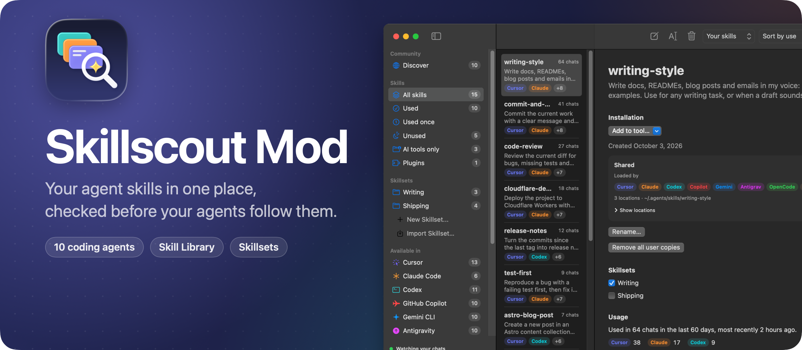
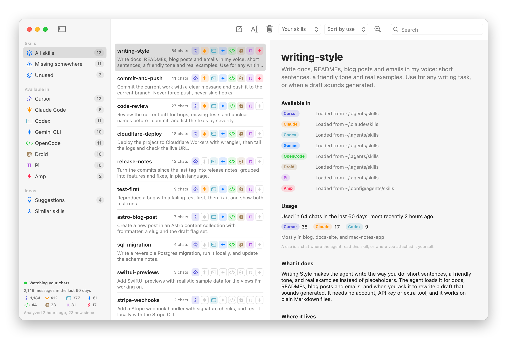
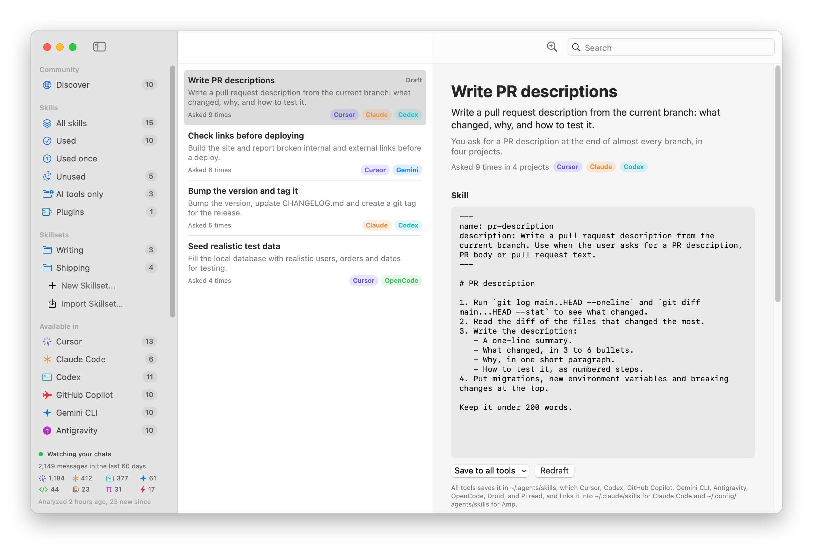

Skillscout is a Mac app for the skills your coding agents load. It finds every skill on your Mac, shows which agents can see each one, and counts how often you use them.

It knows 10 agents: Cursor, Claude Code, Codex, GitHub Copilot, Gemini CLI, Antigravity, OpenCode, Droid, Pi and Amp. Each one reads skills from its own folders, and some also read the folders of the others. So a skill you wrote for Claude Code can load in Cursor but not in Codex. Skillscout maps all of it, and adds a skill to the agents that miss it with one click.

It also reads your chats. It counts a use every time an agent loads a skill, and it looks for requests you keep typing, so you can turn them into new skills.

Read the announcement and watch the 1-minute demo on my blog: [I built Skillscout, a Mac app for the skills your coding agents load](https://flaviocopes.com/skillscout/).

[](https://flaviocopes.com/skillscout/)

## Download

Get `Skillscout-1.1.0.zip` from the [latest release](https://github.com/flaviocopes/skillscout/releases/latest), unzip it, and drag Skillscout to your Applications folder. It runs on macOS 15 Sequoia or later, on Apple silicon and Intel Macs.

### Opening it the first time

Skillscout isn't signed with an Apple Developer ID or notarized by Apple. So the first time you open it, macOS says it "could not verify Skillscout is free of malware". Click **Done**, then allow it in one of two ways.

In System Settings, open **Privacy & Security** and scroll down to the message about Skillscout. Click **Open Anyway**, confirm, and open the app again. The button shows up for about an hour after you try to open the app.

In Terminal, remove the quarantine flag macOS adds to downloaded files, then open the app:

```sh
xattr -dr com.apple.quarantine /Applications/Skillscout.app
```

The same command fixes a message saying Skillscout is damaged. You don't need to turn off Gatekeeper for either option.

On a work laptop you might not be able to install apps in `/Applications`. You can keep Skillscout in the `Applications` folder inside your home folder, and run the command on `~/Applications/Skillscout.app`. If your company blocks apps that aren't notarized, ask your IT team.

### Updates

Once a day, Skillscout asks GitHub whether there's a newer version. When there is, it shows what's new, and **Install and Relaunch** puts it in place of the old one. **Skillscout → Check for Updates…** checks right away. The `skillscout` command lives inside the app, so it updates too.

To turn off the daily check, run this in Terminal:

```sh
defaults write com.flaviocopes.skillscout AppUpdaterAutomaticChecks -bool false
```

## Features

- Every skill from your agents in one list, with a row of icons showing which agents load it
- **Missing somewhere** lists the skills at least one of your agents can't see
- **Add to** links the skill folder into another agent's skills folder, so every agent loads the same file
- **Uninstall** moves a skill to the Trash, from all your skills folders or from one of them
- **Skillsets** group skills into reusable collections, with explicit assignments to each agent and previews of changes
- **Unused** lists the skills no chat touched in the last 60 days
- Usage for each skill: how many chats, from which agents, in which projects, and when you last used it
- The skills you created last come first, and you can sort by name or by use instead
- Search by name or description with `⌘F`
- **Explain with AI** asks Claude Code or Codex what a skill does, when the agent uses it, and what it needs to work
- **Suggestions** finds the tasks you keep asking for and drafts a `SKILL.md` for each one
- Plugin and built-in skills from Cursor, Claude Code and Codex, behind a toggle in the toolbar
- Every copy of a skill on disk, with a warning when two copies have different content
- The list and the counts update while you work, as skills and chats change on disk
- A `skillscout` command for your terminal that reads the same data
- Updates from inside the app: it checks GitHub once a day, and **Install and Relaunch** puts the new version in place
- Light and dark appearance following the macOS setting

## Discover and Library

Discover includes repositories from Android, Anthropic, Vercel, Matt Pocock, and ComposioHQ by default. These are browsing suggestions; nothing is downloaded until you choose **Add to Library**.

Choose **Add to Library** in Discover to download a repository into `~/.config/skillscout/skills`. Its skills appear in the library and under Sources; Discover creates no new AI-tool links. Choose **Browse skills** to open its source list, then use **Add to tool…** on a skill or put it in a skillset. A repository can contain many skills, so you choose which ones each tool gets.

Use **Add Custom Source** to save a Git repository URL or choose a local folder containing one or more `SKILL.md` files. Adding a local source to Library copies the folder; **Refresh from Folder** updates that copy after you edit the original. Existing links to skills in the Library copy stay in place.

**Re-download** or **Refresh from Folder** stages a replacement before changing the library copy. If the source is missing or the replacement would break an existing tool link, the current copy stays. **Remove from Library…** moves the repository and links into it to the Trash after confirmation; independent copies stay. Adding a custom source to Discover only saves its address or path until you choose **Add to Library**. The CLI's `skillscout install` still links skills to enabled or supported tools by default.

## Skillsets

Create a skillset in the sidebar, then use **Edit…** to select its members from the library and sources. Use **Manage…** to review and change its tool assignments. You can also select multiple skills in a list, right-click, and choose **Add to skillset**. In a skillset list, **Remove from skillset** or Delete changes membership; it doesn't uninstall the skill.

If multiple repositories provide a skill with the same name, choose its source when adding it to a tool or in the skillset editor. Skillscout saves that choice and shows all repository copies in the skill's Installation section.

Choose **Apply…** for an agent to preview additions, existing installations, removals and conflicts. A skillset can be assigned to several agents, and several skillsets can be assigned to one agent. Shared members stay installed until no assigned skillset needs them. Editing membership shows **Changes pending**; choose **Apply changes…** to update that agent. Missing sources and failed changes remain visible and can be retried.

**Unassign…** in a management row's action menu removes only unchanged links or copies that Skillscout created for skillsets and that no remaining assignment needs. Personal installations and modified copies stay. Agents can still read skills from shared folders or other agents' folders, so **Not assigned** can coexist with available skills; the assignment row explains inherited sources. Existing skillsets migrate as unassigned collections, without claiming ownership of previous installations.

<picture>
  <source media="(prefers-color-scheme: dark)" srcset="docs/screenshot-dark.png" />
  
</picture>

## The agents it knows

Every agent has its own skills folder, and its own place for chats:

| Agent | Skills folder | Chats |
| --- | --- | --- |
| Cursor | `~/.cursor/skills` | `~/.cursor/projects/*/agent-transcripts` |
| Claude Code | `~/.claude/skills` | `~/.claude/projects` and `~/.claude/history.jsonl` |
| Codex | `~/.codex/skills` | `~/.codex/sessions` and `~/.codex/archived_sessions` |
| GitHub Copilot | `~/.copilot/skills` | - |
| Gemini CLI | `~/.gemini/skills` | `~/.gemini/tmp/*/chats` |
| Antigravity | `~/.gemini/antigravity/skills` | - |
| OpenCode | `~/.config/opencode/skills` | `~/.local/share/opencode/opencode.db` |
| Droid | `~/.factory/skills` | `~/.factory/sessions` |
| Pi | `~/.pi/agent/skills` | `~/.pi/agent/sessions` |
| Amp | `~/.config/agents/skills` | `~/.local/share/amp/threads` |

Some folders are read by more than one agent. `~/.agents/skills` is a shared folder that Cursor, Codex, Gemini CLI, OpenCode, Droid and Pi all load. Cursor and OpenCode also load `~/.claude/skills`, and Cursor loads `~/.codex/skills` too. Claude Code and Amp only read their own folders.

Skillscout knows these rules, so for every skill it tells you which agents load it and from which folder.

With the toolbar toggle on, it also shows plugin skills from `~/.cursor/plugins`, `~/.claude/plugins/cache` and `~/.codex/plugins/cache`, plus the built-in skills of Cursor and Codex.

Skillscout turns on the agents it finds on your Mac. You can turn any of them off in Settings, and Skillscout stops showing its skills and reading its chats.

## Adding a skill to more agents

Pick a skill, and the **Installation** section shows its library source and which agents load each copy. Use **Add to tool…** to make it available to another agent.

Adding a skill creates a symbolic link to the skill folder inside that agent's skills folder. The agents all load the same `SKILL.md`, so when you edit it, every one of them gets the change.

Plugin skills get copied instead of linked, because a plugin update replaces its folders.

## Removing a skill

Pick a skill and click **Remove** next to a copy under **Installation**. You can also right-click it in the list, or select it and press Delete, to remove all user-managed copies. Select multiple skills to uninstall them together. Skillscout moves the selected folders and links to the Trash, so you can put them back from there.

To take a skill away from some agents only, click **Remove** next to one of its folders. If other folders link to that one, the links go too, since they'd point to nothing. When you remove a link, the folder it points to stays.

Before anything moves, Skillscout tells you which agents will stop loading the skill.

Plugin and built-in skills stay where they are. Their agents manage them, so uninstall the plugin to remove its skills.

## Counting uses

A use is a chat where the agent read the skill, or where you attached it yourself.

Skillscout looks for the moment an agent opens a skill's `SKILL.md`. That can be a skill tool call, a file read, or a shell command that prints the file. It also counts the skills you attach in Cursor and the slash commands you run in Claude Code. A chat counts once per skill, however many times the agent reads it.

It reads the last 60 days of chats. You can change that to 30, 90 or 180 days in Settings.

## Skill ideas

Some requests you type again and again, like "check the links before deploying" or "bump the version and tag it". Each one could be a skill.

Open **Suggestions** and click **Find repeated tasks** in its toolbar. Skillscout sends your 2,000 most recent messages to Claude Code or Codex. It asks for requests you keep making that a skill could handle, and skips the ones your skills already cover. Each idea shows how many times you asked, in which projects, and the messages that match.

<picture>
  <source media="(prefers-color-scheme: dark)" srcset="docs/screenshot-suggestions-dark.png" />
  
</picture>

Click **Draft the skill with AI** to get a `SKILL.md` you can edit right there. **Save to all tools** writes it to `~/.agents/skills` and links it into `~/.claude/skills` and `~/.config/agents/skills`, so all 10 agents load it. The menu next to it saves the skill for a single agent. **Dismiss this idea** hides it, and later runs won't suggest it again.

After your first run, Skillscout analyzes again on its own once you've sent 40 new messages, at most every 30 minutes. You can change the number, or turn it off, in Settings.

## The command line tool

Skillscout comes with a `skillscout` command. To install it, open the Skillscout menu and choose **Install Command Line Tool…**. It links the command inside the app into `/usr/local/bin`, and asks for your password if that folder needs it.

The command reads the same skills and chats as the app, and follows its settings, like which agents are on and how many days of chats to read.

| Command | What it does |
| --- | --- |
| `skillscout list` | Lists your skills and the agents that load them |
| `skillscout show <skill>` | Where a skill lives, which agents see it, and its usage |
| `skillscout usage` | Ranks skills by how many chats used them |
| `skillscout tools` | The agents Skillscout knows, and where each one keeps its skills |
| `skillscout add <skill> --to <tool>` | Adds a skill to another agent |
| `skillscout uninstall <skill>` | Moves a skill to the Trash |
| `skillscout suggest` | Asks AI for skill ideas based on requests you repeat |
| `skillscout explain <skill>` | Asks AI what a skill does |

Run `skillscout` alone for a summary, and `skillscout help <command>` for the options of each command.

`list` shows a column for each agent. A dot means that agent can't see the skill:

```sh
skillscout list
```

```
SKILL              CHATS  Cu Cl Co Ge Op Dr Pi Am DESCRIPTION
astro-blog-post        7  ●  ·  ●  ●  ●  ●  ●  ·  Create a new post in an Astro content collection …
cloudflare-deploy     18  ●  ●  ●  ●  ●  ●  ●  ·  Deploy the project to Cloudflare Workers with wra…
code-review           27  ●  ●  ●  ●  ●  ●  ●  ·  Review the current diff for bugs, missing tests a…
commit-and-push       41  ●  ●  ●  ●  ●  ●  ●  ●  Commit the current work with a clear message and …
pdf-invoices           –  ●  ●  ·  ·  ●  ·  ·  ·  Generate PDF invoices from a JSON order, with the…
```

Add `--missing` to see only the skills some agent can't load, `--unused` for the ones no chat used, or `--tool claude` for the skills one agent loads. `--sort use` puts your most used skills first, and `--sort newest` the ones you created last.

`show` tells you what's missing and prints the command that fixes it:

```sh
skillscout show release-notes
```

```
release-notes
Turn the commits since the last tag into release notes, grouped into features and fixes, in plain
language.

Available in
  ● Cursor       ~/.agents/skills
  · Claude Code  missing  skillscout add release-notes --to claude
  ● Codex        ~/.agents/skills
  ● Gemini CLI   ~/.agents/skills
  ● OpenCode     ~/.agents/skills
  ● Droid        ~/.agents/skills
  ● Pi           ~/.agents/skills
  · Amp          missing  skillscout add release-notes --to amp
```

`usage` ranks your skills, with the chats from each agent:

```sh
skillscout usage
```

```
SKILL              CHATS  LAST USED    TOOLS
writing-style         64  2 hours ago  Cursor 38, Claude Code 17, Codex 9
commit-and-push       41  5 hours ago  Cursor 22, Claude Code 11, Codex 5, Amp 3
code-review           27  1 day ago    Cursor 9, Claude Code 14, OpenCode 4
cloudflare-deploy     18  2 days ago   Cursor 7, Codex 11
release-notes         12  4 days ago   Cursor 8, Gemini CLI 4
```

`add` works like the button in the app. Pass `--to` with one agent, or `--all` for every agent you use that's missing the skill:

```sh
skillscout add release-notes --all
```

`uninstall` moves every copy of a skill to the Trash. Pass `--from` with one agent to remove only the copy in that agent's skills folder, which undoes an `add`:

```sh
skillscout uninstall release-notes --from amp
```

`suggest` and `explain` take `--engine codex` or `--engine claude`, and `--model` to pick the model. `explain` returns the app's saved explanation when there is one, and `--fresh` asks again.

Most commands take `--json`, so you can use Skillscout from scripts:

```sh
skillscout list --unused --json
```

## Privacy

Skillscout reads your skill folders and your chats on your Mac, and has no accounts or analytics. The only request it makes on its own goes to GitHub: once a day, it asks whether there's a newer version of Skillscout, and it downloads one only when you click **Install and Relaunch**.

Discover reads a registry bundled with the app. Adding a repository to Library, re-downloading it, and the CLI's `update` command run Git against the repository you select. These operations contact its host and download skill files; they don't send your chats.

Your chats leave your Mac only through the AI features. **Explain with AI**, **Find repeated tasks** and **Draft the skill with AI** run the Codex CLI or the Claude Code CLI you're already logged in to, so the prompt goes to OpenAI or Anthropic under your own account. To find skill ideas, that prompt includes up to 2,000 of your recent messages, each cut to 220 characters, with the agent and project it came from.

Skillscout runs Codex with `--ephemeral` in a read-only sandbox, and Claude Code with `--no-session-persistence` and no tools. These runs don't show up in your chat history.

Skillscout keeps its own data in `~/Library/Application Support/Skillscout`. There's a cache of the chats it parsed, and the explanations, ideas and drafts it saved.

## Build it from source

You need macOS 15 or later and Xcode 26. The app icon is an Icon Composer file, and older Xcode versions can't build it.

Open `Skillscout.xcodeproj` and press `⌘R`. To build the release zip from the terminal, run:

```sh
scripts/build-release.sh
```

It builds a universal app in `build/release/Release/Skillscout.app`, checks its signature, and zips it into `dist/`. The app is ad-hoc signed. A copy you build yourself opens without a warning.

The `skillscout` command is its own target, `SkillscoutCLI`, and the app embeds it in `Contents/Helpers`. To build only the command:

```sh
xcodebuild -project Skillscout.xcodeproj -target SkillscoutCLI -configuration Release build
```

## Development

The Xcode project is generated from `project.yml` with [XcodeGen](https://github.com/yonaskolb/XcodeGen). After editing `project.yml`, regenerate it:

```sh
xcodegen generate
```

The command line tool shares the app's core files: the models, the skill scanner, the chat readers, the installer and the AI engine. Its own code lives in `CLI/`.

The app icon is drawn in code. Edit `scripts/render-icon.swift`, then write a new `Skillscout/AppIcon.icon`:

```sh
swift scripts/render-icon.swift
```

The screenshots come from the real app views, with made-up skills and chats in a demo home folder. The capture app has its own bundle ID, so your settings and skills stay as they are:

```sh
scripts/screenshot.sh
```

The banner uses the icon and the dark screenshot:

```sh
swift scripts/render-banner.swift
```

Working with an AI coding agent? Point it at [AGENTS.md](AGENTS.md). It has the commands and the rules to follow.

## How it works

At launch Skillscout scans every skills folder it knows. A skill is a folder with a `SKILL.md` file, and the name and description come from its frontmatter. When the same skill shows up in more than one folder, through a link or a copy, Skillscout groups the copies under one name and follows each agent's rules to work out which agents load it.

Then it reads the chats of every agent you turned on. Each agent stores them differently. Cursor, Claude Code, Codex, Droid and Pi write JSONL files, Gemini CLI and Amp write JSON, and OpenCode keeps a SQLite database. Skillscout keeps the messages you typed and the moments an agent loaded a skill, and caches what it parsed. On the next launch it only reads the files whose size or date changed.

An FSEvents watcher on the agents' folders refreshes the list and the counts while you work.

## License

Skillscout is released under the [MIT license](LICENSE). It's provided as is, without warranty of any kind.

Skillscout is an independent project, and it isn't affiliated with the makers of the agents it works with. Cursor, Claude Code, Codex, Gemini CLI, OpenCode, Droid, Pi and Amp are trademarks of their owners.
